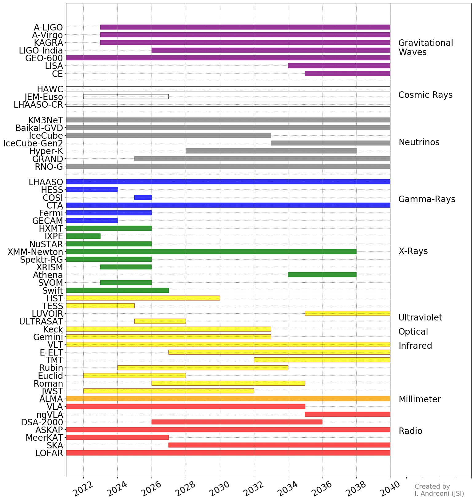
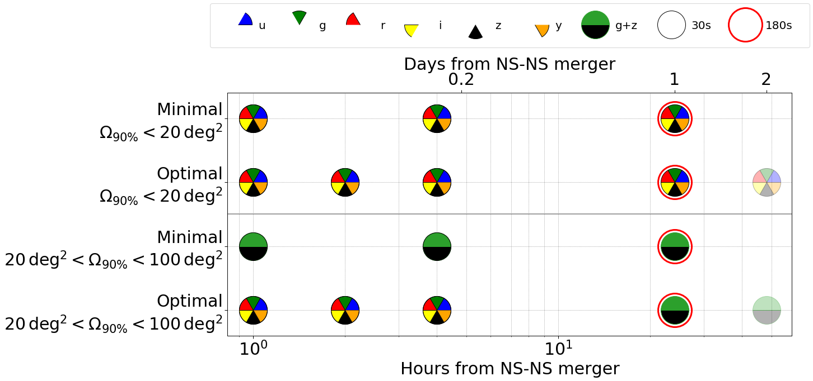
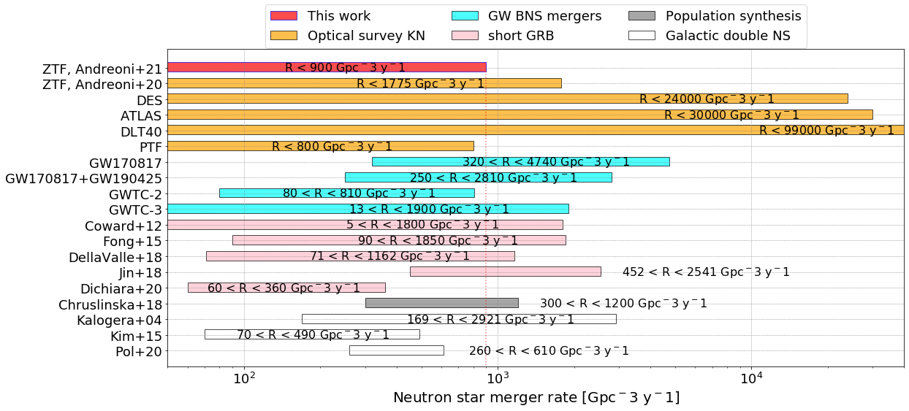

# astro-visualization
Visualization is key to communicate scientific results, especially in Astronomy. In this repository, I collect code that I have used to create some of the plots that appear in my publications or presentations. A citation to the given references, when appropriate, is always very appreciated.

# Timeline for Multi-messenger Facilities

The future is bright for multi-messenger astronomy. Many observatories are coming online soon. With this code, I generated a Gantt chart to show the expected timelines for those projects. Many more projects are being developed in space and on the ground, apologies if you do not see your favorite mission in the chart, it only collects some of them. <br>

Easily add or remove observatories by editing ```timeline.txt```

```
python plot_timeline_observatories.py
```

Software requirements: it works with Python 3; required packages are: matplotlib, numpy.




# Observing Strategy Design

How shall we perform follow-up observations when an interesting transient source is discovered in the sky? This example shows our strategy for the discovery of electromagnetic counterparts to gravitational wave events with Vera C. Rubin Observatory.

<b>Reference</b>: [Andreoni et al. (2021)](https://ui.adsabs.harvard.edu/abs/2021arXiv211101945A/abstract); to be published in The Astrophysical Journal Supplement Series; ArXiv 2111.01945

```
jupyter-notebook plot_strategy.ipynb
```




# Kilonova and Binary Neutron Star Merger Rates

Kilonovae are the optical/infrared counterparts to binary neutron star mergers and, in some cases, of neutron star-black hole mergers. We searched for kilonovae in the industrial-size Zwicky Transient Facility survey data set using the ZTFReST pipeline, finding cosmological afterglows serendipitously along the way. We then created a plot (below) to compare our results with rates for binary neutron star mergers obtained with gravitational wave observations and other observational means.


<b>Reference</b>: [Andreoni & Coughlin et al. (2021)](https://ui.adsabs.harvard.edu/abs/2021ApJ...918...63A/abstract); The Astrophysical Journal, Volume 918, Issue 2, id.63, 16 pp.

ZTFReST for fast transient discovery: https://github.com/growth-astro/ztfrest

```
jupyter-notebook plot_rates.ipynb
```


